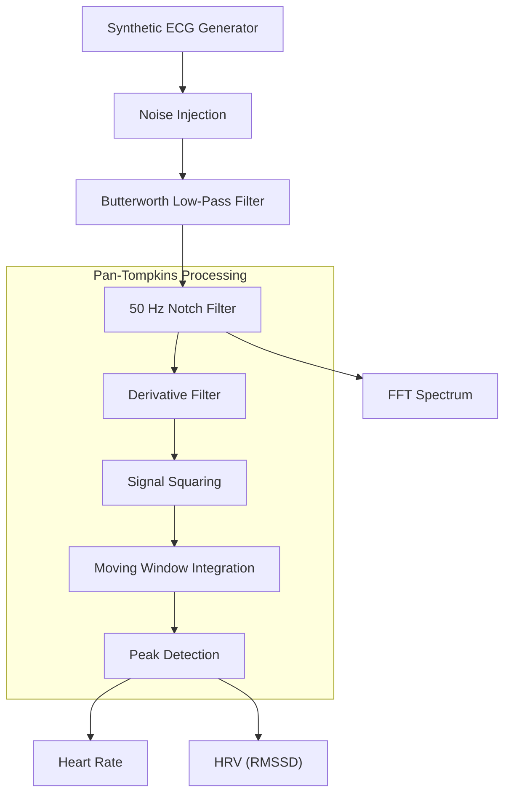
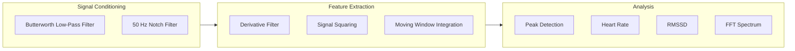
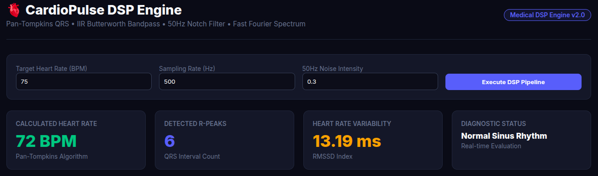
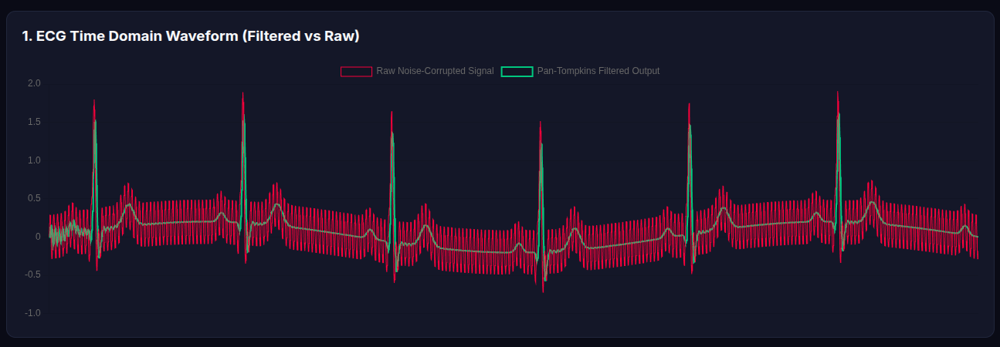
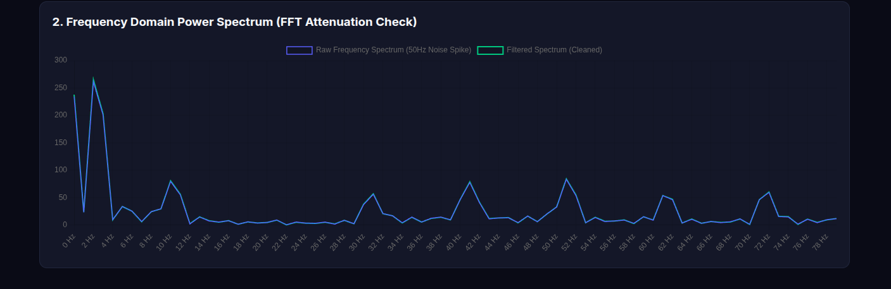

# 🫀 CardioPulse DSP | Java Biomedical Signal Processing Engine

[](https://www.oracle.com/java/)
[](https://spring.io/projects/spring-boot)
[](https://www.docker.com/)
[](https://render.com)

CardioPulse DSP is a full-stack **Java Spring Boot** application that demonstrates real-time **Biomedical Digital Signal Processing (DSP)** concepts using synthetic ECG (Electrocardiogram) signals.

The application generates ECG waveforms, injects configurable electrical and physiological noise, filters the signal using digital filters, detects QRS complexes using a Pan-Tompkins-based processing pipeline, computes heart rate metrics, and visualizes both time-domain and frequency-domain analyses through an interactive web interface.

Unlike conventional CRUD applications, CardioPulse focuses on implementing mathematical signal-processing algorithms directly in Java while providing an intuitive visualization dashboard.

---

# 🚀 Features

- Synthetic ECG signal generation
- Configurable heart rate simulation
- Adjustable sampling rate
- Adjustable 50 Hz power-line noise intensity
- Butterworth Low-Pass filtering
- 50 Hz Notch filtering
- Pan-Tompkins based QRS detection
- Heart Rate (BPM) calculation
- Heart Rate Variability (RMSSD)
- FFT Spectrum visualization
- Diagnostic rhythm classification
- Interactive Chart.js dashboard
- Dockerized deployment
- Cloud deployment using Render

---

# 📐 System Architecture



---

# 🛠 Signal Processing Pipeline



---

# 📖 Project Overview

CardioPulse DSP simulates a realistic ECG waveform and processes it through a sequence of digital signal-processing stages.

The application allows users to interactively adjust physiological and signal-processing parameters while observing their impact on the ECG waveform and calculated cardiac metrics.

The processing pipeline consists of:

1. ECG waveform synthesis
2. Electrical noise injection
3. Butterworth Low-Pass filtering
4. 50 Hz Notch filtering
5. Pan-Tompkins based QRS detection
6. Heart rate calculation
7. Heart rate variability analysis
8. FFT spectrum visualization

---

# ❤️ ECG Signal Generation

The application generates synthetic ECG signals representing the normal cardiac cycle consisting of:

- P Wave
- QRS Complex
- T Wave

Additional signal disturbances can be introduced through adjustable parameters including:

- 50 Hz power-line interference
- Baseline fluctuations
- Configurable signal noise intensity

This enables users to observe how digital filtering improves signal quality before QRS detection.

---

# 🔬 Digital Filtering

## Butterworth Low-Pass Filter

The first processing stage applies a second-order Butterworth Low-Pass filter to reduce unwanted high-frequency noise while preserving the primary morphology of the ECG waveform.

### Purpose

- Remove high-frequency artifacts
- Preserve cardiac waveform characteristics
- Improve signal quality for peak detection

---

## 50 Hz Notch Filter

The filtered signal is then processed using a 50 Hz Notch Filter to suppress electrical interference introduced by AC power sources.

### Purpose

- Remove power-line interference
- Preserve useful ECG information
- Improve frequency-domain characteristics

---

# ⚡ Pan-Tompkins Based QRS Detection

After filtering, the signal is processed using a Pan-Tompkins inspired detection pipeline.

Processing stages include:

- Derivative filtering
- Signal squaring
- Moving window integration
- Peak detection

Detected R-peaks are used to calculate:

- Heart Rate (BPM)
- Heart Rate Variability (RMSSD)

---
# 🎛 Interactive Controls

The dashboard allows users to modify signal parameters in real time and immediately observe their effect on the generated ECG waveform and computed metrics.

| Parameter | Default | Description |
|-----------|---------|-------------|
| Target Heart Rate | **75 BPM** | Controls the spacing between synthesized heartbeats. |
| Sampling Rate | **500 Hz** | Determines the sampling frequency used for signal generation and processing. |
| 50 Hz Noise Intensity | **0.30** | Controls the amplitude of injected electrical power-line interference. |

---

# 📊 Real-Time Metrics

After processing the ECG signal, the application continuously calculates and displays:

| Metric | Description |
|---------|-------------|
| ❤️ Heart Rate (BPM) | Beats per minute calculated from detected R-peaks. |
| ❤️ R-Peak Count | Number of detected R-peaks in the processed signal. |
| ❤️ HRV (RMSSD) | Root Mean Square of Successive Differences between RR intervals. |
| 📈 FFT Spectrum | Frequency-domain representation of the ECG signal after filtering. |
| 🩺 Diagnostic Status | Rhythm classification based on calculated heart rate. |

---

# 📈 Diagnostic Status

The calculated heart rate is automatically classified into one of the following categories.

| Status | Condition |
|---------|-----------|
| 🟢 Normal Sinus Rhythm | 60–100 BPM |
| 🔴 Tachycardia | Above 100 BPM |
| 🔵 Bradycardia | Below 60 BPM |

---

# 📷 Application Screenshots

> Place your screenshots inside **docs/images/**

## Dashboard

Displays the interactive ECG dashboard with signal parameters, heart rate metrics, ECG waveform, FFT spectrum, and diagnostic status.

```text
docs/images/dashboard.png
```



---

## ECG Signal Processing

Comparison of noisy and filtered ECG waveforms after Butterworth Low-Pass and 50 Hz Notch filtering.

```text
docs/images/ecg-waveform.png
```



---

## FFT Spectrum

Frequency-domain visualization showing attenuation of the injected 50 Hz interference after digital filtering.

```text
docs/images/fft-spectrum.png
```



---

# 💻 Technology Stack

## Backend

- Java 17
- Spring Boot 3
- Maven

---

## Digital Signal Processing

- Butterworth Low-Pass Filter
- 50 Hz Notch Filter
- Pan-Tompkins Based QRS Detection
- Apache Commons Math (FFT)

---

## Frontend

- HTML5
- CSS3
- Thymeleaf
- Chart.js

---

## DevOps

- Docker
- Render Cloud Platform

---

# ⭐ Key Highlights

- Pure Java DSP implementation
- Interactive ECG signal generation
- Configurable signal parameters
- Digital filtering using Butterworth and Notch filters
- Pan-Tompkins based R-peak detection
- Heart rate and HRV analysis
- FFT spectrum visualization
- Interactive web dashboard
- Dockerized deployment
- Cloud hosted using Render

---
# ⚙️ Run Locally

## Prerequisites

Before running the project locally, ensure the following software is installed:

- Java JDK 17 or later
- Apache Maven 3.8+
- Git

---

## Clone the Repository

```bash
git clone https://github.com/tarungowdac-1/cardiopulse.git
cd cardiopulse
```

---

## Build the Project

```bash
mvn clean package -DskipTests
```

---

## Run the Application

```bash
java -jar target/cardiopulse-1.0.0.jar
```

Open your browser and navigate to:

```
http://localhost:8080
```

---

# 🐳 Running with Docker

## Build Docker Image

```bash
docker build -t cardiopulse-java .
```

---

## Run Docker Container

```bash
docker run -p 8080:8080 cardiopulse-java
```

Access the application at:

```
http://localhost:8080
```

---
