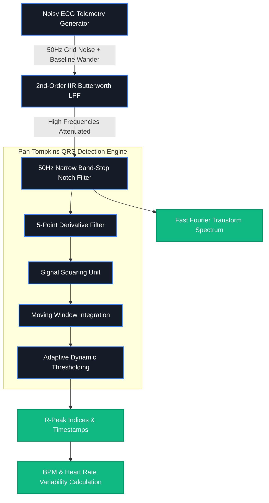
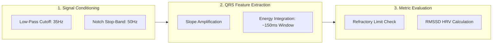

# 🫀 CardioPulse DSP | Enterprise Biomedical Signal Engine

[](https://www.oracle.com/java/)
[](https://spring.io/projects/spring-boot)
[](https://www.docker.com/)

CardioPulse DSP is a full-stack, cloud-deployed **Java Biomedical Signal Processing Engine**. It synthesizes real-time ECG (Electrocardiogram) telemetry corrupted by environmental electrical grid noise and physiological movement, processes it through digital filter cascades, and performs high-accuracy QRS detection and spectral analytics.

---

## 📐 System Architecture & DSP Pipeline



---

## Most web applications are simple CRUD (Create, Read, Update, Delete) systems. **CardioPulse DSP stands out because it solves low-level mathematical and digital signal processing (DSP) challenges on the backend:**

1. **Custom DSP Algorithms in Pure Java:** Built low-pass IIR Butterworth and Notch filters directly from difference equations without relying on external black-box signal processing libraries.
2. **Clinical-Grade Peak Detection:** Implemented the industry-standard **Pan-Tompkins Algorithm** featuring 5-point derivatives, signal squaring, moving-window integration, and dynamic adaptive thresholding.
3. **Dual Domain Analytics (Time & Frequency):** Uses **Fast Fourier Transforms (FFT)** via Apache Commons Math to mathematically prove powerline noise suppression in the frequency spectrum alongside time-domain waveform charts.
4. **End-to-End Cloud Engineering:** Containerized multi-stage Docker build pipeline deployed on Render with dynamic control parameters (Sampling Rate, Noise Intensity, Target BPM).

---

## 🛠️ Detailed Filtering Pipeline



### 1. Physiological Waveform Synthesis

Synthesizes exact **P-QRS-T** cardiac morphology using Gaussian superposition, injected with **50Hz powerline grid hum** and **low-frequency (0.3Hz) respiratory baseline wander**.

### 2. Cascaded Digital Filtering Pipeline

* **2nd-Order IIR Butterworth Low-Pass Filter (35Hz Cutoff):** Attenuates high-frequency muscle noise and jitter using recursive difference equations.
* **Narrow Band-Stop Notch Filter (50Hz):** Eliminates electrical grid interference without distorting cardiac wave features.

### 3. Pan-Tompkins QRS Detection Engine

* **5-Point Derivative Filter:** Isolates the high slope of the QRS complex.
* **Squaring Function:** Amplifies slope energy and forces all values positive.
* **Moving Window Integration (~150ms):** Smooths high-frequency bursts into single envelope pulses.
* **Adaptive Thresholding:** Dynamically calculates peak cutoff limits and applies refractory limits (~200 BPM max) to prevent double-counting.

---

## 🎛️ Control Parameters & Interactive Inputs

CardioPulse DSP allows real-time signal manipulation directly from the user interface. Adjusting these parameters dynamically alters the math executed in the Spring Boot backend:

| Input Parameter | Default Value | Physiological & Signal Impact |
| --- | --- | --- |
| **Target Heart Rate (BPM)** | `75 BPM` | Adjusts the periodic spacing of synthesized P-QRS-T complexes. |
| **Sampling Rate (Hz)** | `500 Hz` | Sets the discrete time step. Higher rates increase DSP resolution. |
| **50Hz Noise Intensity** | `0.3` | Controls the amplitude multiplier of the injected powerline AC grid interference. |

---

## 📈 Diagnostic Status Conditions

The engine automatically evaluates output heart rate metrics and displays instant clinical feedback:

* 🟢 **Normal Sinus Rhythm:** Calculated heart rate is between **60 BPM** and **100 BPM**.
* 🔴 **Tachycardia Detected:** Calculated heart rate exceeds **100 BPM**.
* 🔵 **Bradycardia Detected:** Calculated heart rate falls below **60 BPM**.

---

## 📊 Feature Metrics Calculated in Real Time

* **Heart Rate (BPM):** Precise beats-per-minute calculated directly from detected R-peak timing intervals.
* **Heart Rate Variability (HRV / RMSSD):** Root-mean-square of successive beat differences in milliseconds.
* **Diagnostic Status:** Automated physiological evaluation (**Normal Sinus Rhythm**, **Tachycardia**, or **Bradycardia**).
* **Power Spectrum Density:** FFT magnitude plot demonstrating 50Hz noise spike flattening.

---

## 💻 Tech Stack

* **Core Backend:** Java 17, Spring Boot 3
* **DSP Math Library:** Apache Commons Math 3 (Fast Fourier Transform)
* **Frontend UI:** HTML5, CSS3, Thymeleaf, Chart.js
* **DevOps & Cloud:** Docker (Multi-stage Build), Render Cloud Platform

---

## ⚙️ How to Run Locally

### Prerequisites

* Java JDK 17 or higher
* Apache Maven 3.8+

### Setup Commands

```bash
# 1. Clone the repository
git clone [https://github.com/tarungowdac-1/cardiopulse.git](https://github.com/tarungowdac-1/cardiopulse.git)
cd cardiopulse

# 2. Build and package the application
mvn clean package -DskipTests

# 3. Launch the Spring Boot engine
java -jar target/cardiopulse-1.0.0.jar

```

*Open your browser and navigate to `http://localhost:8080`.*

---

## 🐳 Running with Docker

```bash
# Build Docker Image
docker build -t cardiopulse-java .

# Run Container
docker run -p 8080:8080 cardiopulse-java

```

```

```
