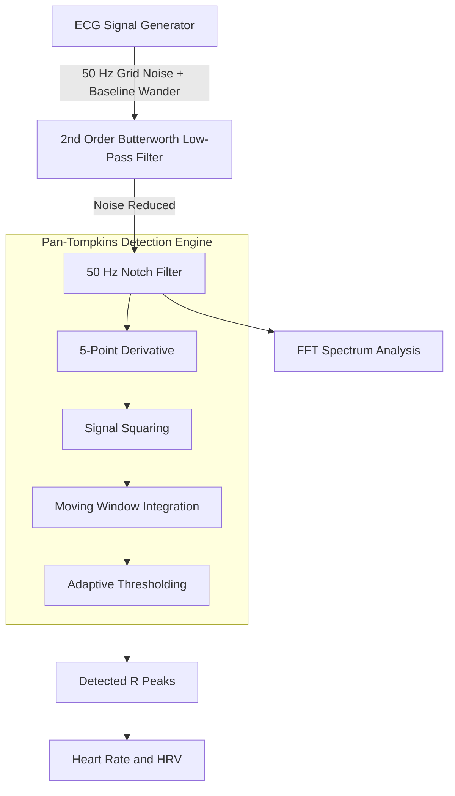
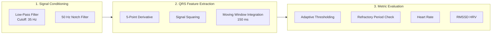

# 🫀 CardioPulse DSP | Enterprise Biomedical Signal Processing Engine

[](https://www.oracle.com/java/)
[](https://spring.io/projects/spring-boot)
[](https://www.docker.com/)
[](https://render.com)

CardioPulse DSP is a full-stack, cloud-deployed **Java Biomedical Signal Processing Engine** that synthesizes realistic ECG (Electrocardiogram) telemetry, injects physiological and electrical noise, processes the signal through digital filter cascades, and performs high-accuracy **Pan-Tompkins QRS detection**, **heart-rate analytics**, **HRV computation**, and **frequency-domain analysis**.

Unlike traditional CRUD applications, CardioPulse focuses on **Digital Signal Processing (DSP)**, mathematical modeling, and biomedical analytics implemented directly in Java.

---

# 📐 System Architecture & DSP Pipeline



---

# 🚀 Why CardioPulse DSP?

Most web applications primarily perform CRUD (Create, Read, Update, Delete) operations. **CardioPulse DSP** demonstrates backend engineering through digital signal processing, mathematical algorithms, and biomedical analytics.

### ✔ Custom DSP Algorithms

- 2nd-order Butterworth Low-Pass Filter
- 50 Hz Digital Notch Filter
- Recursive difference equation implementation
- Pure Java implementation without external DSP libraries

### ✔ Clinical-Grade Peak Detection

Implements the **Pan-Tompkins Algorithm**, including:

- Five-point derivative filtering
- Signal squaring
- Moving-window integration
- Adaptive thresholding
- Refractory period enforcement

### ✔ Time & Frequency Domain Analysis

- ECG waveform visualization
- Fast Fourier Transform (FFT)
- Frequency spectrum analysis
- Power-line noise suppression verification

### ✔ Cloud Engineering

- Spring Boot backend
- Docker multi-stage builds
- Render cloud deployment
- Interactive parameter controls

---

# 🛠 Detailed DSP Processing Pipeline



---

# ❤️ Physiological Waveform Synthesis

The ECG waveform is mathematically synthesized using Gaussian superposition to generate realistic **P-QRS-T cardiac morphology**.

Noise sources intentionally added include:

- 50 Hz electrical power-line interference
- Respiratory baseline wander (0.3 Hz)
- Adjustable signal noise intensity

---

# 🔬 Digital Filtering Pipeline

## 2nd-Order Butterworth Low-Pass Filter

Removes high-frequency muscle artifacts and random noise while preserving the morphology of ECG waveforms.

**Specifications**

- Filter Type: IIR Butterworth
- Order: 2
- Cutoff Frequency: 35 Hz

---

## 50 Hz Notch Filter

Removes electrical interference introduced by AC power systems without distorting cardiac features.

---

# ⚡ Pan-Tompkins QRS Detection

The QRS detector follows the classical Pan-Tompkins processing stages:

1. Five-point derivative filter
2. Signal squaring
3. Moving-window integration
4. Adaptive threshold calculation
5. Refractory period validation

The detected R-peaks are then used to compute:

- Heart Rate (BPM)
- RR intervals
- Heart Rate Variability (RMSSD)

---

# 🎛 Interactive Control Parameters

The web interface allows dynamic adjustment of ECG synthesis and DSP parameters.

| Parameter | Default | Description |
|-----------|---------|-------------|
| Target Heart Rate | **75 BPM** | Controls spacing between synthesized heartbeats |
| Sampling Rate | **500 Hz** | Determines discrete-time DSP resolution |
| 50 Hz Noise Intensity | **0.3** | Controls injected electrical interference amplitude |

---

# 📈 Automatic Diagnostic Status

The application classifies rhythm based on detected heart rate.

| Status | Condition |
|---------|-----------|
| 🟢 Normal Sinus Rhythm | 60–100 BPM |
| 🔴 Tachycardia | Above 100 BPM |
| 🔵 Bradycardia | Below 60 BPM |

---

# 📊 Real-Time Analytics

CardioPulse continuously computes and visualizes:

- ❤️ Heart Rate (BPM)
- ❤️ Heart Rate Variability (RMSSD)
- ❤️ R-Peak Detection
- ❤️ ECG Waveform
- 📈 FFT Frequency Spectrum
- 📉 Noise Suppression Performance
- 🩺 Rhythm Classification

---

# 💻 Technology Stack

## Backend

- Java 17
- Spring Boot 3

## Digital Signal Processing

- Apache Commons Math 3
- Fast Fourier Transform (FFT)

## Frontend

- HTML5
- CSS3
- Thymeleaf
- Chart.js

## DevOps & Deployment

- Docker
- Multi-stage Docker Builds
- Render Cloud Platform

---

# ⚙ Run Locally

## Prerequisites

- Java JDK 17+
- Apache Maven 3.8+

---

## Clone Repository

```bash
git clone https://github.com/tarungowdac-1/cardiopulse.git
cd cardiopulse
```

---

## Build Application

```bash
mvn clean package -DskipTests
```

---

## Run Spring Boot

```bash
java -jar target/cardiopulse-1.0.0.jar
```

Open your browser:

```
http://localhost:8080
```

---

# 🐳 Run with Docker

## Build Image

```bash
docker build -t cardiopulse-java .
```

## Start Container

```bash
docker run -p 8080:8080 cardiopulse-java
```

Visit:

```
http://localhost:8080
```

---

# ✨ Project Highlights

- ✅ Pure Java Biomedical Signal Processing
- ✅ Mathematical ECG Signal Synthesis
- ✅ 2nd-Order Butterworth Low-Pass Filter
- ✅ 50 Hz Digital Notch Filter
- ✅ Pan-Tompkins QRS Detection
- ✅ Adaptive Dynamic Thresholding
- ✅ Fast Fourier Transform (FFT)
- ✅ Heart Rate & HRV (RMSSD) Analytics
- ✅ Interactive Signal Controls
- ✅ Real-Time ECG Visualization
- ✅ Spring Boot Backend
- ✅ Dockerized Deployment
- ✅ Cloud Hosted on Render

---

# 📷 Application Preview

> Add screenshots or GIFs of your application here.

Example:

```
docs/images/dashboard.png
docs/images/fft-spectrum.png
docs/images/ecg-waveform.png
```

---

# 🎯 Future Enhancements

- Real ECG dataset support
- Wavelet-based denoising
- Arrhythmia classification
- Real-time WebSocket streaming
- Export ECG reports as PDF
- REST API for biomedical analytics

---

## 👨‍💻 Author

**Tarun Gowda C**

Java Backend Developer | Spring Boot | DSP | Cloud Deployment

GitHub: https://github.com/tarungowdac-1
