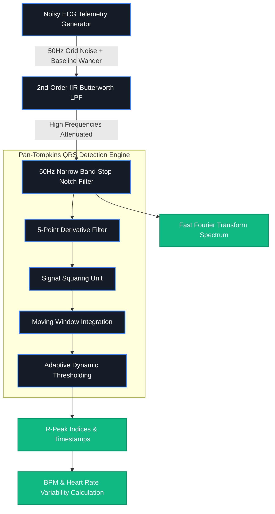

# 🫀 CardioPulse DSP | Enterprise Biomedical Signal Engine

[](https://www.oracle.com/java/)
[](https://spring.io/projects/spring-boot)
[](https://www.docker.com/)

CardioPulse DSP is a full-stack, cloud-deployed **Java Biomedical Signal Processing Engine**. It synthesizes real-time ECG (Electrocardiogram) telemetry corrupted by environmental electrical grid noise and physiological movement, processes it through digital filter cascades, and performs high-accuracy QRS detection and spectral analytics.

---

# 📐 System Architecture & DSP Pipeline



---

# Why CardioPulse DSP?

Most web applications are simple CRUD (Create, Read, Update, Delete) systems. **CardioPulse DSP stands out because it solves low-level mathematical and digital signal processing (DSP) challenges on the backend.**

### 1. Custom DSP Algorithms in Pure Java
Built low-pass IIR Butterworth and Notch filters directly from difference equations without relying on external black-box signal processing libraries.

### 2. Clinical-Grade Peak Detection
Implemented the industry-standard **Pan-Tompkins Algorithm** featuring:

- 5-point derivative filtering
- Signal squaring
- Moving-window integration
- Dynamic adaptive thresholding

### 3. Dual-Domain Analytics (Time & Frequency)

Uses **Fast Fourier Transform (FFT)** through Apache Commons Math to mathematically demonstrate:

- Suppression of 50 Hz powerline noise
- Frequency spectrum analysis
- Time-domain ECG visualization

### 4. End-to-End Cloud Engineering

- Multi-stage Docker build
- Spring Boot backend
- Render cloud deployment
- Dynamic runtime parameters

---

# 🛠️ Detailed Filtering Pipeline

```mermaid
flowchart LR
    subgraph Stage1[1. Signal Conditioning]
        direction TB
        S1A[Low-Pass Cutoff: 35Hz]
        S1B[Notch Stop-Band: 50Hz]
    end

    subgraph Stage2[2. QRS Feature Extraction]
        direction TB
        S2A[Slope Amplification]
        S2B[Energy Integration (~150 ms)]
    end

    subgraph Stage3[3. Metric Evaluation]
        direction TB
        S3A[Refractory Limit Check]
        S3B[RMSSD HRV Calculation]
    end

    Stage1 --> Stage2 --> Stage3
```

---

# 1️⃣ Physiological Waveform Synthesis

Synthesizes realistic **P-QRS-T cardiac morphology** using Gaussian superposition.

Injected artifacts include:

- 50 Hz electrical powerline interference
- 0.3 Hz respiratory baseline wander

---

# 2️⃣ Cascaded Digital Filtering Pipeline

### 2nd-Order IIR Butterworth Low-Pass Filter

- 35 Hz cutoff frequency
- Removes high-frequency muscle noise
- Recursive difference equation implementation

### Narrow Band-Stop Notch Filter

- Center Frequency: 50 Hz
- Removes AC powerline interference
- Preserves ECG waveform morphology

---

# 3️⃣ Pan-Tompkins QRS Detection Engine

The detection pipeline consists of:

- **5-Point Derivative Filter** – emphasizes QRS slopes
- **Signal Squaring** – increases energy while eliminating negative values
- **Moving Window Integration (~150 ms)** – smooths energy envelopes
- **Adaptive Thresholding** – dynamically determines R-peaks while enforcing refractory limits (~200 BPM maximum)

---

# 🎛️ Interactive Control Parameters

The frontend allows dynamic manipulation of backend DSP parameters.

| Parameter | Default | Effect |
|-----------|----------|--------|
| Target Heart Rate | **75 BPM** | Controls spacing between synthesized beats |
| Sampling Rate | **500 Hz** | Determines discrete-time DSP resolution |
| 50 Hz Noise Intensity | **0.3** | Adjusts injected powerline interference amplitude |

---

# 📈 Diagnostic Status

The engine automatically classifies cardiac rhythm.

| Status | Condition |
|---------|-----------|
| 🟢 Normal Sinus Rhythm | 60–100 BPM |
| 🔴 Tachycardia | >100 BPM |
| 🔵 Bradycardia | <60 BPM |

---

# 📊 Real-Time Metrics

The application continuously computes:

- Heart Rate (BPM)
- Heart Rate Variability (RMSSD)
- Diagnostic Rhythm Status
- FFT Power Spectrum Density
- Detected R-Peaks
- ECG Waveform Visualization

---

# 💻 Tech Stack

### Backend

- Java 17
- Spring Boot 3

### DSP

- Apache Commons Math 3 (FFT)

### Frontend

- HTML5
- CSS3
- Thymeleaf
- Chart.js

### DevOps

- Docker
- Render Cloud Platform

---

# ⚙️ Run Locally

## Prerequisites

- Java JDK 17+
- Maven 3.8+

## Clone Repository

```bash
git clone https://github.com/tarungowdac-1/cardiopulse.git
cd cardiopulse
```

## Build

```bash
mvn clean package -DskipTests
```

## Run

```bash
java -jar target/cardiopulse-1.0.0.jar
```

Open:

```
http://localhost:8080
```

---

# 🐳 Docker

Build Image

```bash
docker build -t cardiopulse-java .
```

Run Container

```bash
docker run -p 8080:8080 cardiopulse-java
```

Open:

```
http://localhost:8080
```

---

# 🚀 Highlights

✅ Pure Java Digital Signal Processing

✅ Butterworth & Notch Filters

✅ Pan-Tompkins QRS Detection

✅ FFT Frequency Analysis

✅ Real-Time ECG Visualization

✅ Heart Rate & HRV Analytics

✅ Spring Boot Backend

✅ Dockerized Deployment

✅ Render Cloud Hosting

---
